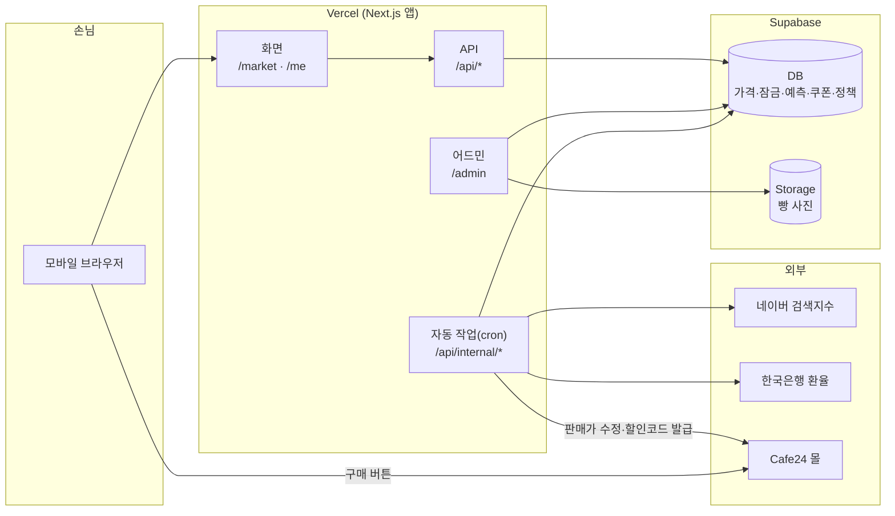
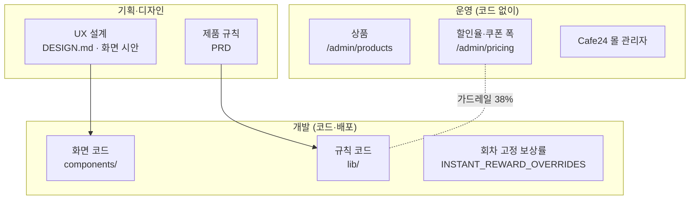

# 막지스톡 인계 — 구조와 분담

> 2026-10-07 기준. 파일이 어디 있는지, 어떤 환경에서 도는지, 어떤 일을 어디서 하는지, 그리고 AI 에이전트(Claude Code 등)에게 일을 맡길 때 무엇을 읽히면 되는지 정리합니다. 폴더 트리 전체와 경로별 설명은 [README](../../README.md#프로젝트-구성)에 있습니다.

## 1. 한 장으로 보는 구조

코드는 네 층으로 나뉩니다. 위에서 아래로 갈수록 화면과 멀고 규칙에 가깝습니다.

| 층 | 경로 | 하는 일 |
|---|---|---|
| 화면 | `app/(bread)/`, `app/admin/`, `components/` | 손님 화면(마켓·MY)과 어드민 |
| 서버 입구 | `app/api/`, `proxy.ts` | 화면 요청 처리, 자동 작업, 어드민 잠금 |
| 규칙 | `lib/bread-market/`, `lib/locks/`, `lib/predictions/`, `lib/rewards/`, `lib/admin/` | 화면 데이터 조립, 잠금·예측·쿠폰 규칙, 운영 정책 |
| 계산·연동 | `lib/pricing/`, `lib/cafe24/`, `supabase/` | 가격 산식, 외부 API, DB |

## 2. 환경

| | 로컬 개발 | 운영 |
|---|---|---|
| 앱 | `npm run dev` → http://localhost:3000 | Vercel (main 브랜치에 푸시하면 자동 배포) |
| DB | 로컬 Supabase (`supabase start`, API 54421, Storage 켜 둠) | Supabase 운영 프로젝트 |
| 새 DB 세팅 | `supabase/setup.sql` 한 파일 실행 | 같음 (이미 운영 중이면 새 마이그레이션 파일만) |
| Cafe24 | 쓰기(가격·할인코드) 안 보냄. 꼭 필요할 때만 `CAFE24_ALLOW_LOCAL_WRITES=1` | 데모몰 `rabbit3456`에 실제로 씀 |
| 자동 작업 | 돌지 않음 (필요하면 curl 로 직접 호출) | `vercel.json` 일정대로, Hobby 요금제(하루 1회·±59분) |
| 검사 | `npm test` | 푸시·PR 마다 GitHub Actions 가 `npm test` |

환경변수는 [`.env.example`](../../.env.example)에 모두 있습니다. 로컬은 `.env.local`, 운영은 Vercel 프로젝트 설정에 둡니다.

## 3. 메모리·컨텍스트 상태

에이전트가 읽는 "기억"은 두 가지입니다. **저장소 안에 있는 것만 팀이 공유합니다.**

| 위치 | 무엇 | 공유 |
|---|---|---|
| `AGENTS.md` (`CLAUDE.md`가 불러옴) | "이 Next.js는 16 버전이라 학습 데이터와 다르다, `node_modules/next/dist/docs/`를 먼저 읽어라" | 저장소에 있음 |
| 코드 주석 | 이 저장소의 주석은 **"왜 이렇게 했나"** 를 적습니다(예: 왜 쿠폰 천장이 세 항인지). 에이전트에게 가장 정확한 컨텍스트입니다 | 저장소에 있음 |
| `docs/` | 제품 기준(PRD), 결정 이유, 운영 가이드 | 저장소에 있음 |
| `.omc/`, 각자 Claude 개인 메모리 | 개인 세션 상태·선호 | **공유 안 됨** (`.gitignore`) |

새로운 결정이 생기면 개인 메모리가 아니라 **문서나 주석에 남겨야** 다음 사람이 압니다.

## 4. 경로별 에이전트 작업 가이드

일을 맡길 때 "먼저 읽힐 것"을 함께 주면 결과가 훨씬 정확합니다. 아래 표를 그대로 프롬프트에 붙여도 됩니다.

| 하려는 일 | 먼저 읽힐 컨텍스트 | 손댈 곳 | 끝났는지 확인 |
|---|---|---|---|
| 손님 화면 수정 (문구·배치·상태) | [DESIGN.md](../../DESIGN.md), [PRD](../PRD-브레드마켓.md) §6, 해당 컴포넌트의 주석 | `components/bread-market/`, `app/globals.css` | `npm test`, 로컬 화면 (폭 400px로 확인) |
| 어드민 화면 수정 | [PRD](../PRD-브레드마켓.md) §27, [어드민 시안](https://claude.ai/artifact/DC9R8izPk4p4jtHg5AUa9o) | `app/admin/`, `lib/admin/`, `app/admin/admin.css` | `npm test`, 로컬 `/admin` |
| 산식·쿠폰 값 바꾸기 | **코드 작업이 아닙니다.** [02-운영.md](02-운영.md#할인율쿠폰-보상률을-바꿀-때) | 어드민 `/admin/pricing` | 백테스트 결과 |
| 산식 계산 방식 자체를 바꾸기 | [산식과 쿠폰 공부노트](../산식과-쿠폰-공부노트.md), [산식 버전](../산식-버전.md), [할인율 결정 리포트](../할인율-결정-리포트.md) | `lib/pricing/pricing.mjs` (`calculateDay`), `lib/bread-market/policy.ts` | `npm test` + `npm run backtest` |
| 잠금·예측 규칙 | [PRD](../PRD-브레드마켓.md) §4~§5, `lib/bread-market/reward-policy.ts` 주석 | `lib/bread-market/reward-policy.ts`, `lib/locks/`, `lib/predictions/`, `app/api/locks`, `app/api/predictions` | `npm test` (`tests/reward-policy`, `prediction*`) |
| 자동 작업·시각 | [가격 자동화 실행 가이드](../가격자동화-실행가이드.md), [검색지수 도착 시각](../네이버-검색지수-도착시각.md) | `vercel.json`, `app/api/internal/`, `lib/pricing/daily-job.ts` | `npm test` (`tests/cron-*`) |
| Cafe24 연동 | [04-Cafe24-연결.md](04-Cafe24-연결.md), [실행 가이드](../가격자동화-실행가이드.md)의 "연결 몰" 절 | `lib/cafe24/`, `lib/rewards/discount-code.ts` | 드라이런 호출 (02-운영 참고) |
| KPI·집계 | [KPI 설계](../KPI-시장규모-BM-설계.md) | `supabase/migrations/` (새 번호), `supabase/snippets/`, `app/admin/kpi` | 로컬 DB 에서 SQL 실행 |
| DB 바꾸기 | [로직 구조](../NextJS-Supabase-MARKET-ME-로직구조.md) §6 | `supabase/migrations/0NN_*.sql` 새 파일 → `npm run db:setup-sql` | `npm test` (`setup-sql` 검사) |

에이전트에게 공통으로 줄 규칙:

- 사실은 코드에서 확인한 뒤에 쓰고, 확인 못 한 것은 "확인 필요"로 남긴다.
- 끝내기 전에 `npm test`를 돌린다(단위 테스트 + 타입 검사 + lint).
- **마이그레이션이 들어간 변경은 운영 DB 에 먼저 적용한 뒤에 푸시한다.** 푸시하면 바로 배포되는데, 새 코드가 아직 없는 테이블·컬럼을 읽으면 운영 화면이 깨진다(2026-10-02에 실제로 겪음).
- 가격·할인 정책은 감으로 정하지 않고 백테스트 숫자로 정한다.

## 5. 분담 구조 — 어떤 일을 어디서 하나

### UX 설계는 어디에서

| 무엇 | 어디 |
|---|---|
| 기준 (색·글자·컴포넌트·접근성·문구 톤) | [DESIGN.md](../../DESIGN.md) |
| 화면 흐름과 상태 (언제 무엇이 보이나) | [PRD](../PRD-브레드마켓.md) §6, [로직 구조](../NextJS-Supabase-MARKET-ME-로직구조.md) §3 |
| 시안 | 어드민: [Claude 디자인 캔버스](https://claude.ai/artifact/DC9R8izPk4p4jtHg5AUa9o). 손님 화면: 1차 프로토타입에서 출발 ([로직 구조](../NextJS-Supabase-MARKET-ME-로직구조.md) §2) |
| 구현 | 손님 화면 `components/bread-market/` + `app/globals.css`, 어드민 `app/admin/` + `app/admin/admin.css` |

손님 화면은 **휴대폰 크기(최대 430px)** 로 화면 가운데에 띄우는 구조입니다. 어드민만 화면 전체를 씁니다.

### 할인 프로모션은 어디에서

할인을 움직이는 손잡이는 네 개이고, 손대는 곳이 다릅니다. 어느 경우든 **상품 할인 + 쿠폰이 주문당 38%를 넘지 않는** 가드레일은 코드가 지킵니다(`checkPolicy`, `couponAmountWon`).

| 손잡이 | 효과 | 어디서 | 코드 배포 필요 |
|---|---|---|---|
| 상시 할인 폭 (산식 상한·가중치) | 매일 가격 전체 | 어드민 `/admin/pricing` | 아니요 |
| 쿠폰 보상률 폭 (안정형 오전·오후, 공격형) | 새로 받는 쿠폰 | 어드민 `/admin/pricing` | 아니요 |
| 특정 회차 안정형 보상률 고정 (이벤트) | 그 회차 안정형만 | `lib/bread-market/reward-policy.ts`의 `INSTANT_REWARD_OVERRIDES` | 예 |
| 몰 자체 쿠폰·할인 | 몰 전체 | Cafe24 몰 관리자 | 아니요 — **단 38% 가드레일 밖**이라 막지스톡 할인과 겹치지 않게 설정 확인 필요 |

절차는 [02-운영.md](02-운영.md)에 있습니다.
