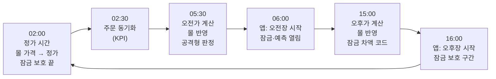
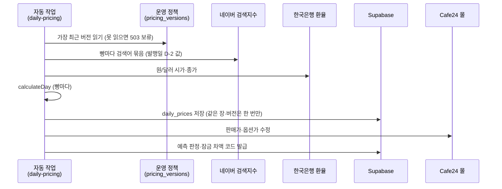
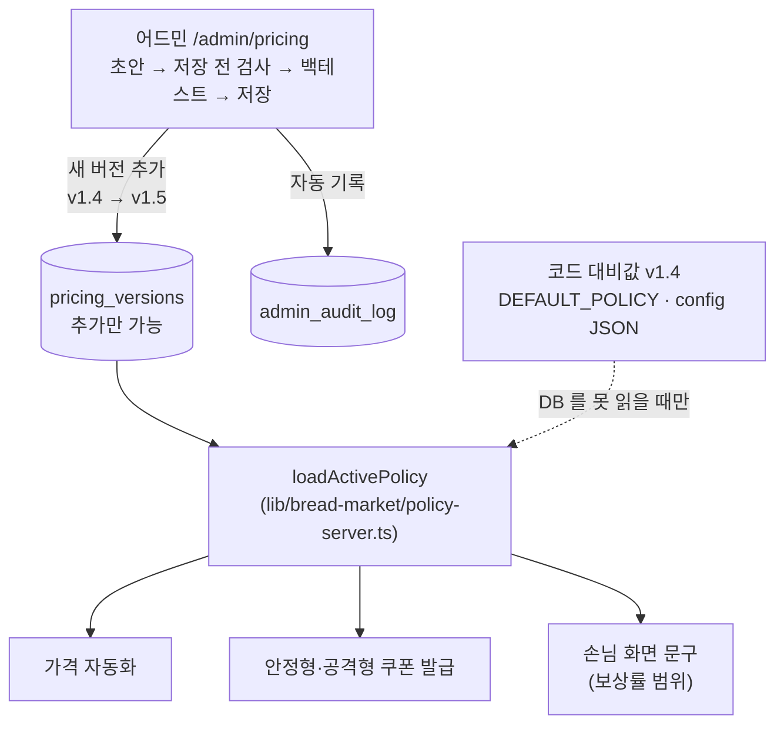
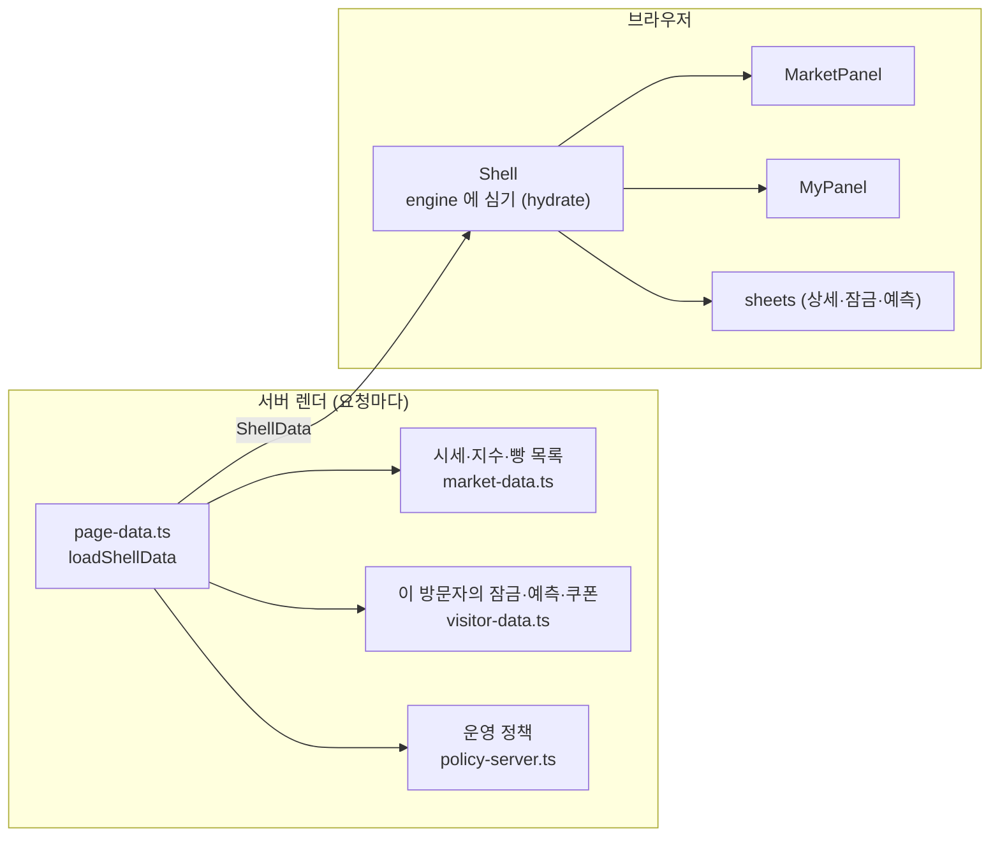
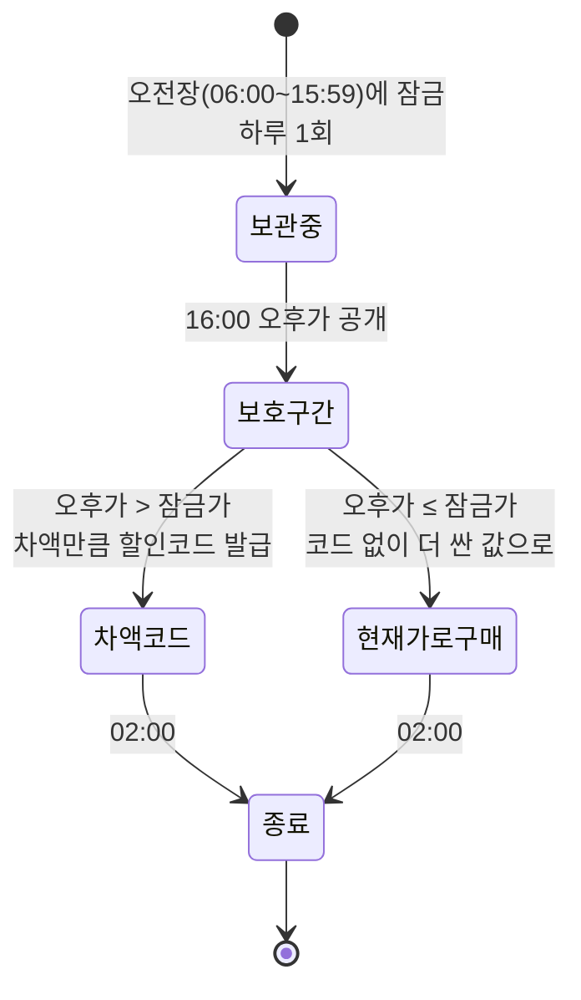
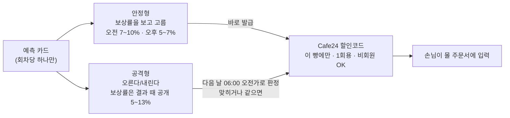
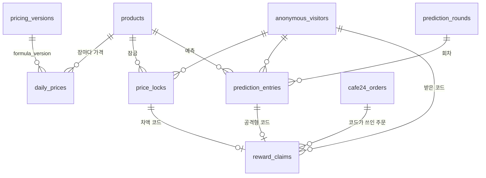
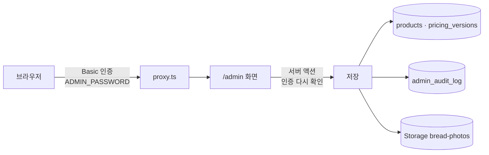

# 막지스톡 인계 — 기술 (내부 동작)

> 2026-10-07 기준. 가격이 계산되어 몰과 화면에 나가기까지의 흐름을 그림 위주로 설명합니다. 각 절 끝의 **자세히** 링크가 세부 기술 문서로 이어집니다. 다이어그램은 GitHub 에서 그대로 그려집니다(Mermaid).

## 1. 하루의 흐름

시장의 하루는 자정이 아니라 **02:00(KST)** 에 바뀝니다.



- 자동 작업은 `vercel.json`에 있고, 무료 요금제(Hobby)라 적힌 시각부터 한 시간 안 아무 때나 돕니다.
- 06:00~10:00 매시, 검색지수가 늦어 보류된 빵만 다시 계산합니다.
- 주말에도 장은 열립니다. 환율만 외환시장이 쉬어 금요일 값으로 이월합니다.

**자세히**: [가격 자동화 실행 가이드](../가격자동화-실행가이드.md), [PRD](../PRD-브레드마켓.md) §3·§11

## 2. 가격 계산



산식(v1.4)은 한 줄로 요약하면 이렇습니다.

```text
할인율 = clamp( 검색지수 × 0.15  +  환율하락률 × 14 (±28%p 안),  0,  25 )
판매가 = 정가 × (1 − 할인율) 을 10원 단위로
```

- 매번 **정가에서 새로** 계산합니다. 전날 가격에 누적하지 않습니다.
- 계산 함수는 `lib/pricing/pricing.mjs`의 `calculateDay` 하나입니다. 자동 작업, 어드민 백테스트, `backtest/`가 같은 함수를 씁니다.
- 검색지수는 네이버가 전날 값을 오전 8~9시대에 올려서, 05:30에 확실히 있는 **D-2** 값을 씁니다. 없으면 0으로 바꾸지 않고 그 빵만 보류합니다.

**자세히**: [산식과 쿠폰 공부노트](../산식과-쿠폰-공부노트.md) §2, [할인율 결정 리포트](../할인율-결정-리포트.md), [네이버 검색지수 도착 시각](../네이버-검색지수-도착시각.md)

## 3. 운영 정책은 DB 한 곳에서

산식 숫자와 쿠폰 보상률은 코드가 아니라 DB `pricing_versions`의 **가장 최근 행**에서 읽습니다.



- DB 를 못 읽으면 화면은 대비값으로 보여주지만, **가격 계산과 안정형 쿠폰 발급은 멈춥니다(503).** 대비값으로 가격을 내면 그날 어떤 산식이었는지 알 수 없게 되기 때문입니다.
- 화면과 서버가 같은 검사(`checkPolicy`)를 씁니다. 주문당 최대 할인 38%, 안정형 최대 < 공격형 최대 같은 규칙이 여기 있습니다.
- `tests/policy.test.mjs`가 코드 대비값, `config/pricing-products.json`, 010 마이그레이션의 v1.4, `backtest/config.json`이 모두 같은지 지킵니다.

**자세히**: [산식 버전](../산식-버전.md), [PRD](../PRD-브레드마켓.md) §27

## 4. 가격이 바뀌는 시각

앱 화면과 몰 가격은 **바뀌는 주체가 다릅니다.**

| | 앱 화면 | Cafe24 몰 가격 |
|---|---|---|
| 누가 바꾸나 | 손님 브라우저의 시계 | 서버 자동 작업 |
| 언제 | 06:00·16:00·02:00 정각 | 자동 작업이 도는 순간 (오후가는 15:00~15:59) |
| 요금제 영향 | 없음 | Hobby ±59분, Pro 는 분 단위 |

- 화면은 시세를 미리 받아 두고, 시각이 되면 그 장의 가격을 보여줍니다. 서버는 공개 시각 전의 가격을 내보내지 않습니다(`isPublicAt`).
- 16:00에 시세가 새로 들어오면 목록·그래프를 다시 계산합니다(`marketStamp`). 휴대폰 화면이 꺼졌다 켜지면 시계를 즉시 다시 읽고, 30초 넘게 가려져 있었으면 서버 데이터를 다시 받습니다.
- 몰과 앱을 정각에 함께 바꾸려면 Vercel Pro 와 함께 "15:00 계산 / 16:00 몰 반영"으로 작업을 나누는 코드 수정이 필요합니다(아직 안 함).

**자세히**: [PRD](../PRD-브레드마켓.md) §6.2·§11.1

## 5. 손님 화면이 데이터를 받는 길



- 빵 목록도 DB(`products`)에서 옵니다. `engine.ts`가 판매 중이고 시세가 한 줄 이상 있는 빵만 목록(`BREADS`)에 넣습니다. 그래서 방금 추가한 빵은 첫 가격 계산 뒤에 나타납니다. 판매를 멈춘 빵도 전체 목록(`CATALOG`)에는 남아, 그 빵의 잠금·쿠폰 기록은 계속 보입니다.
- 방문자는 첫 `page_view` 때 받는 쿠키 `visitor_token`(1년, HttpOnly)으로 구분합니다. 서버에는 해시만 저장합니다. 로그인은 없습니다.

**자세히**: [로직 구조](../NextJS-Supabase-MARKET-ME-로직구조.md) §3·§4

## 6. 가격 잠금



- 몰 가격을 손님마다 바꿀 수 없어서, 오른 만큼을 **할인코드로** 돌려줍니다.
- 하루 1회는 DB 유니크 제약이 지킵니다. 주말에는 잠금이 닫힙니다.
- 화면의 단계는 시각으로 정합니다(`lib/bread-market/flow.ts`의 `lockPhaseOf`). 코드 발급 여부는 서버만 압니다.

**자세히**: [PRD](../PRD-브레드마켓.md) §4·§5, [가격 잠금 1회 사유](../가격-잠금-1회-사유.md)

## 7. 예측과 쿠폰



쿠폰 금액은 세 값 중 가장 작은 것입니다.

```text
min( 판매가 × 보상률,  정가 × (38 − 운영 상한)%,  판매가 − 정가 × 62% ) 을 10원 단위로 내림
```

세 번째 항은 상한을 바꾼 날, 옛 상한으로 나간 더 싼 가격 위에 쿠폰이 얹혀 38%를 넘지 않게 막습니다.

- 안정형 보상률은 회차로 정해져서(`instantRewardPct`) 화면과 서버가 같은 값을 말합니다. 화면을 연 뒤 어드민이 보상률을 바꿨으면 서버가 409로 거절하고 새 값을 다시 보여줍니다.
- 할인코드(쿠폰 아님)를 쓰는 이유: Cafe24 쿠폰은 회원 전용이라 익명·비회원 구조에 맞지 않습니다.

**자세히**: [산식과 쿠폰 공부노트](../산식과-쿠폰-공부노트.md) §4·§5, [매수가 기준 예측 제외 사유](../매수가-기준-예측-제외-사유.md)

## 8. 데이터 모델 (핵심 테이블)



- `products`: 빵 목록의 정본 (정가, 검색어, 판매 여부, 화면 이름, 사진, 몰 상품번호·주소)
- `pricing_versions`, `admin_audit_log`: 추가만 됩니다. 고치거나 지우려 하면 DB 가 막습니다.
- 모든 테이블은 RLS 가 켜져 있고, 브라우저는 DB 를 직접 읽지 않습니다. 서버만 service_role 로 읽고 씁니다.

**자세히**: [로직 구조](../NextJS-Supabase-MARKET-ME-로직구조.md) §6·§7, `supabase/schema.sql`, `supabase/migrations/`

## 9. 어드민



- 비밀번호 하나를 공유하는 방식입니다. 관리자가 여럿이 되면 Supabase Auth 로 바꾸는 것이 다음 단계입니다.
- 어드민 방문은 KPI 방문자 수에 세지 않습니다.

**자세히**: [PRD](../PRD-브레드마켓.md) §27, [로직 구조](../NextJS-Supabase-MARKET-ME-로직구조.md) §4.1

## 10. 테스트가 지키는 것

`npm test` = 단위 테스트 + 백테스트 테스트 + 타입 검사 + lint. 푸시마다 GitHub Actions 가 돌립니다.

| 테스트 | 지키는 것 |
|---|---|
| `tests/pricing-core`, `previous-price`, `search-carry-forward` | 산식, 직전 가격, 검색지수 이월·보류 |
| `tests/policy`, `reward-policy` | 정책 검사, 38% 천장, 쿠폰 금액, 대비값 일치 |
| `tests/catalog` | 빵 목록 (멈춘 빵, 새 빵은 시세 뒤에) |
| `tests/cron-schedule`, `cron-session`, `daily-job`, `market-calendar` | 자동 작업 시각, 장 판정, D-2, 주말 |
| `tests/prediction`, `prediction-schedule` | 예측 판정과 회차 |
| `tests/setup-sql` | 새 DB 세팅 파일이 최신인지 |
| `tests/crypto`, `cafe24-time`, `variant-pricing`, `shop-no`, `current-price`, `surge`, `disc-mark` | 암호화, Cafe24 시간·옵션가, 현재가, 급등주, 할인 표시 |
