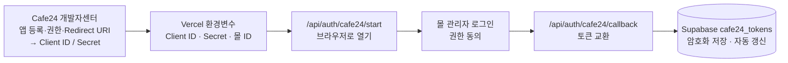

# 막지스톡 인계 — Cafe24 연결과 권한

> 2026-10-07 기준. 막지스톡이 Cafe24 몰의 판매가를 바꾸고 할인코드를 만들려면, **Cafe24 개발자센터의 앱**과 **몰 관리자의 동의**가 필요합니다. 어디에 들어가서 무엇을 하는지 순서대로 적었습니다. 개발자센터 화면의 메뉴 이름은 개편에 따라 조금 다를 수 있습니다. 순서는 [Cafe24 공식 앱 개발 안내](https://appservice-guide.s3.ap-northeast-2.amazonaws.com/attFile/explanation_case.pdf)와 [OAuth 2.0 인증 가이드](https://apidocs.cafe24.com/docs/guide/oauth2-authentication)를 따랐습니다.

## 1. 전체 그림

한 번 연결하면 서버가 토큰을 알아서 갱신합니다. 다시 할 일은 **몰을 바꿀 때, 권한을 추가할 때, 토큰이 만료됐을 때**뿐입니다.

## 2. 지금 상태

| 항목 | 값 |
|---|---|
| 연결된 몰 | 데모몰 `rabbit3456` (Vercel `CAFE24_MALL_ID`) |
| Redirect URI | `https://makji-stock.vercel.app/api/auth/cafe24/callback` |
| 요청 권한 | 아래 표의 5개 (`app/api/auth/cafe24/start/route.ts`의 `SCOPES`) |
| 토큰 보관 | Supabase `cafe24_tokens` (몰마다 한 행, `TOKEN_ENCRYPTION_KEY`로 암호화) |

## 3. 개발자센터에서 앱 만들기 (처음 한 번)

[Cafe24 개발자센터](https://developers.cafe24.com)에 개발자 계정으로 로그인합니다.

1. **앱 등록**: 앱 이름은 알아보기 쉽게 (예: `막지스톡`). 앱스토어 판매 등록은 하지 않습니다. 우리 몰에만 쓰는 앱입니다.
2. **Redirect URI**: 배포 주소 뒤에 `/api/auth/cafe24/callback`을 붙여 넣습니다.
   - 운영: `https://makji-stock.vercel.app/api/auth/cafe24/callback`
   - 배포 주소가 바뀌면 여기와 Vercel `CAFE24_REDIRECT_BASE_URL`을 **함께** 바꿉니다. 한 글자라도 다르면 토큰 교환이 실패합니다.
3. **권한(Scope)**: 아래 세 묶음을 켭니다.

| 개발자센터 권한 묶음 | 코드가 요청하는 scope | 쓰는 곳 |
|---|---|---|
| 상품 (Product) — 읽기·쓰기 | `mall.read_product`, `mall.write_product` | 매일 판매가·옵션가 수정, 02:00 정가 복귀, 상품번호 동기화, 어드민 "연결 확인" |
| 프로모션 (Promotion) — 읽기·쓰기 | `mall.read_promotion`, `mall.write_promotion` | 할인코드 발급 (잠금 차액, 안정형, 공격형) |
| 주문 (Order) — 읽기 | `mall.read_order` | 주문 동기화 → KPI (코드가 쓰인 주문 찾기) |

4. **Client ID / Client Secret 복사**: 앱의 인증 정보에서 복사해 Vercel 환경변수에 넣습니다(다음 절). 문서나 채팅에 붙여 넣지 않습니다.
5. **테스트 설치**: 연결할 몰에 앱을 설치합니다. 데모몰은 개발자 계정에 연결된 테스트 몰이라 개발자센터의 테스트 실행으로 설치합니다.

> **확인 필요 — makji.kr(실제 몰)에 설치할 때**: makji.kr 은 막지 몰 운영자 계정의 몰입니다. 개발자 계정의 테스트 몰로 연결할지, 몰 운영자 계정에서 앱을 설치할지 Cafe24 개발자센터에서 확인해야 합니다. 어느 쪽이든 **몰 운영자가 로그인해서 권한에 동의**하는 단계(5절)는 반드시 거칩니다.

## 4. Vercel 환경변수

Vercel 프로젝트 → Settings → Environment Variables (Production). 바꾼 뒤에는 **다시 배포해야** 반영됩니다.

| 변수 | 값 |
|---|---|
| `CAFE24_CLIENT_ID`, `CAFE24_CLIENT_SECRET` | 3절에서 복사한 값 |
| `CAFE24_MALL_ID` | 연결할 몰 ID (지금 `rabbit3456`, 실제 몰은 makji.kr 의 몰 ID) |
| `CAFE24_SHOP_NO` | 멀티쇼핑몰 번호. 보통 `1` |
| `CAFE24_REDIRECT_BASE_URL` | `https://makji-stock.vercel.app` (끝에 `/` 없이) |
| `TOKEN_ENCRYPTION_KEY` | 토큰 암호화 키 (`openssl rand -hex 32`). **바꾸면 저장된 토큰을 못 읽으므로** 바꾼 뒤 5절을 다시 합니다 |

access token·refresh token·상품번호는 환경변수에 넣지 않습니다.

## 5. 몰 연결 (권한 동의)

1. 브라우저에서 `https://makji-stock.vercel.app/api/auth/cafe24/start`를 엽니다.
2. Cafe24 로그인 화면이 나오면 **연결할 몰의 관리자 계정**으로 로그인하고 권한에 동의합니다.
3. "Cafe24 연결 완료 — 몰 ○○ 토큰을 저장했습니다" 화면이 나오면 끝입니다. 창은 닫아도 됩니다.
4. 확인: 로컬에서 운영 환경변수로 `node scripts/cafe24-token.mjs` 실행 → 몰 ID, 권한 목록, 만료 시각이 나옵니다. 또는 어드민 `/admin/products`의 **연결 확인** 버튼.

10분 안에 같은 브라우저에서 끝내야 합니다(위조 방지용 확인값이 10분 뒤 사라집니다).

## 6. 권한을 추가할 때

예: 2026-09-29에 KPI 용으로 `mall.read_order`를 추가했습니다.

1. 개발자센터 앱에서 해당 권한 묶음을 켭니다.
2. 코드의 `SCOPES`(`app/api/auth/cafe24/start/route.ts`)에 scope 를 더하고 배포합니다.
3. **5절을 다시 합니다.** 이미 저장된 토큰에는 새 권한이 없어서, 다시 동의받기 전까지 그 API 는 403 으로 거절됩니다.

## 7. 토큰 수명

| 토큰 | 유효 기간 | 막지스톡의 처리 |
|---|---|---|
| access token | 2시간 | 만료 5분 전부터 서버가 자동 갱신 |
| refresh token | 14일 | 갱신할 때마다 새로 받아 저장 |

매일 자동 작업이 Cafe24 를 부르므로 토큰은 계속 살아 있습니다. **자동 작업이 2주 넘게 멈췄다면** refresh token 이 만료됐을 수 있으니 5절을 다시 합니다.

## 8. 몰 관리자에서 확인할 것

| 항목 | 확인 방법 | 안 맞으면 |
|---|---|---|
| 상품번호 | 어드민 상품 화면의 Cafe24 칸, **연결 확인** | 어드민에서 번호 수정 |
| 옵션명 | 몰 상품의 옵션명이 `config/cafe24-option-prices.ts`와 글자까지 같은지 | 그 상품만 가격 반영이 실패합니다 (개발자가 설정 수정) |
| 주문서 할인코드 입력란 | 상품을 담고 주문서에서 "할인코드 적용" 칸이 보이는지 (makji.kr 스킨에는 입력란이 이미 있음) | 몰 관리자의 할인코드 기능 설정과 스킨(디자인) 적용 확인 (PRD §12.4) |
| 다른 할인과 겹침 | 몰의 할인코드 설정에서 쿠폰·회원등급 할인과의 **동시 사용이 `사용 안 함`** 인지 (PRD §12.4) | 주문당 38% 가드레일은 막지스톡 할인에만 걸립니다. 동시 사용을 켜 두면 몰 쿠폰이 위에 얹혀 38%를 넘을 수 있습니다 |

## 9. 문제가 생겼을 때

| 화면·증상 | 원인 | 할 일 |
|---|---|---|
| "state 검증 실패" | 10분이 지났거나 다른 브라우저에서 이어 함 | 5절을 처음부터 |
| "토큰 교환 실패" | Client Secret 이 틀렸거나 Redirect URI 가 개발자센터와 다름 | 3절 2번과 4절 값 대조 |
| "인증이 취소됐습니다" | 동의 화면에서 취소 | 다시 시도 |
| 가격 반영·할인코드가 403 | 토큰에 그 권한이 없음 | 6절 |
| 가격 반영·할인코드가 401 | 토큰 만료·폐기 | 5절 |
| 429 | 호출 한도 초과 (10분당 3,000회) | 잠시 뒤 자동으로 풀립니다. 할인코드는 0.6초 간격으로 보냅니다 |

## 10. 실제 몰로 옮길 때

이 문서의 3~5절을 makji.kr 기준으로 다시 하고, 나머지는 [실행 가이드의 "연결 몰" 절](../가격자동화-실행가이드.md#연결-몰-지금은-데모몰)을 따릅니다. 핵심은 `CAFE24_MALL_ID`와 `SHOP_TARGET=live`를 **함께** 바꾸는 것입니다.
